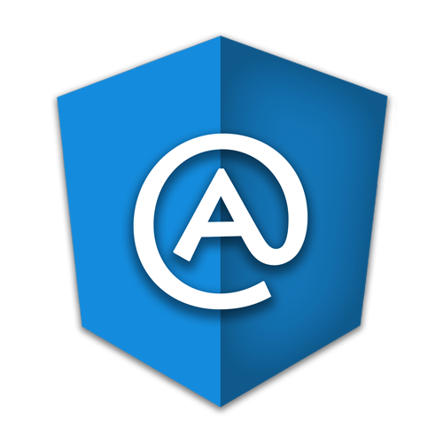

# ng-metadata

[](https://travis-ci.org/ngParty/ng-metadata)
[](https://david-dm.org/ngParty/ng-metadata)
[](https://david-dm.org/ngParty/ng-metadata#info=devDependencies)
[](https://www.npmjs.com/package/ng-metadata)
[](https://raw.githubusercontent.com/ngParty/ng-metadata/master/LICENSE)

> Angular 2 style decorators for Angular 1.x

**ng-metadata** this is a viable solution for people,
who want to gradually update **existing** ng1 codebase to **Typescript** using Angular 2 conventions and styles that 
runs today on Angular 1.4+.

**plain old Angular 1.x with ES5:**

```js
// bootstrap.js
angular.element(document).ready(function(){
  angular.bootstrap(document,['hero']);
});

// hero.js
angular.module('hero',[]);

// hero.component.js
angular.module('hero')
  .directive('hero',heroCmp);

function heroCmp(){
  return {
    scope: {},
    bindToController: {
      name: '=',
      onCall: '&'
    },
    controller: HeroController,
    controllerAs: '$ctrl',
    link: function(scope,element,attrs,ctrl){
      ctrl.init();
    },
    transclude: true,
    templateUrl: 'hero.html'
  };
}

HeroController.$inject = ['log'];
function HeroController($log){
  this.init = function(){ /* your init logic */ };
}
```

**Angular 1.x with ngMetadata and Typescript:**

```typescript
// bootstrap.ts
import {bootstrap} from 'ng-metadata/platform';
import {HeroModule} from './hero';

bootstrap(HeroModule);

// hero.ts
import * as angular from 'angular';
import {provide} from 'ng-metadata/core';
import {HeroComponent} from './hero.component';

export const HeroModule = angular.module('hero',[])
  .directive(...provide(HeroComponent));
  
// hero.component.ts
import {Component,Inject,Input,Output} from 'ng-metadata/core';

@Component({
  selector: 'hero-cmp',
  templateUrl: 'hero.html',
  legacy:{ transclude: true }
})
export class HeroComponent{

  @Input() name: string;
  @Output() onCall: Function;

  constructor(@Inject('$log') private $log: ng.ILogService){}
  
  ngOnInit(){ /* your init logic */ }
  
}
```

with `ngMetadata`, no magic strings, no link function and what not and no more strange angular 1 api syntax.
 
> Write your apps in Angular 2 style today and be more productive! 
> There are no abstractions, just pure Angular 1.x and power of Decorators.
> Treat yourself well and use that power! :)

**TL;DR**

It leads you, to to write **clean and component driven** style code without complicated DDO definition API.

Behind the scenes it uses ES7 decorators extended by Typescript( which adds method parameter decorators etc...)
> parameter deorators are now at stage-0 in TC39, so probably it will be soon available in **Babel** so you can use 
all this goodness with ES6 if you prefer pure JS



## Installation

`npm i --save ng-metadata`

You have to allow nodeJS module resolution style in your `tsconfig.json`

```json
{
  "compilerOptions": {
    "moduleResolution": "node",
    "experimentalDecorators": true
  }
}
```

That's it! Now just start importing from `ng-metadata/core`,`ng-metadata/platform` or `ng-metadata/testing`

> It is also recommended to install angular 1 type definitions, so you get Angular 1 API type checking,
 via [typings](https://github.com/typings/typings) or [tsd](https://github.com/Definitelytyped/tsd)

## Why

There is already an existing project, which gives us Angular 2 like syntax for Angular 1, [ng-forward](https://github.com/ngUpgraders/ng-forward)

While I respect all the hard work of the `ng-forward` team, there were things that I didn't like about their solution. 
Lemme list just few:
- it tries to mirror angular 2 with lots of under the hood abstractions which is just not feasible 
because there are major differences, how things work in ng1 an ng2 
- it tries to do a lot unnecessary work ( support ES5/ES6  like angular 2 does )
- doesn't provides angular 2 like DI via constructor parameters because `babel` just won't support parameter decorators
- forces you to rewrite templates, so you can't be just 100% sure that your code will work as before
- presents totally different unit testing story like you have been used to for ng1 

> although we started a discussion about [collaboration](https://github.com/ngUpgraders/ng-forward/issues/138) I just don't think after further analysis, that we can merge 
our project one way or another.'
 
so those are just few reasons why I made **ng-metadata**.

**ng-metadata:**
- can be used as part of an upgrade strategy, which may also include *ng-upgrade*, when migrating to Angular 2
- uses only pure angular 1 API under the hood
- templates are the same as in angular 1 ( anyway there will be some automatic way to migrate ng1 templates to ng2 )
- supports all kind of strange angular 1 api like creating providers/configuration/runBlocks

## Learn

- Browse the [API Reference](docs/API.md)
- How to migrate es5 to typescript+ngMetadata [Design Patterns](docs/DESIGN-PATTERNS.md)
- explore the [TODO app](playground)
- check [FAQ](docs/FAQ.md) for more explanation why this exist

## Support

### Need Help?

Jump into the [ngParty Slack team](https://ngparty.herokuapp.com/) to join the discussion...

### Think You Found a Bug?

First check the [issues](https://github.com/ngParty/ng-metadata/issues) list to see if someone else has already 
found it and there's an ongoing discussion. If not, submit an [issue](https://github.com/ngParty/ng-metadata/issues).
 Thanks!

## Contributing to the Project

We want help! Please take a look at the [Contribution Guide](CONTRIBUTING.md) for guidelines and jump in the Slack 
team to discuss how you can help: http://ngparty.slack.com... 
if you aren't a member just join us [ngParty slack](https://ngparty.herokuapp.com)
