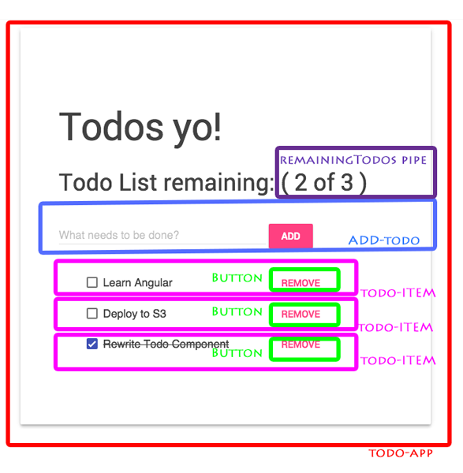

# TODO app 

Here is an example app, how to write component oriented code with Angular 1 + Typescript + ng-metadata.

Architecture is separated in smart + dumb components + composition.

Smart component gets from Store and updates it back on internal changes via immutability. 

There is only one Smart component: 
- `todo-app`

All others are dumb:
- `<add-todo>`
- `<todo-item>`

We are using also pipe to showcase `@Pipe` usage. It could have been also component.
- `remainigTodos`

We use service as Store ( Flux like )
- `todoStore`

Here is UI mockup with components described:

## How to run this demo

1. Clone this repo

1. Run `npm install`

1. Open terminal and launch the app in the browser `npm run playground`

1. Open `http://127.0.0.1:8080/playground` and feel how the Force Awakens inside ( yes I love Star Wars )!
 
